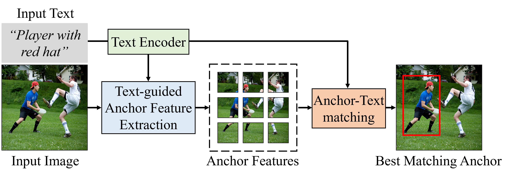

# Enhancing Anchor-based Weakly Supervised Referring Expression Comprehension with Cross-Modality Attention
[](https://www.python.org/)


Weakly supervised Referring Expression Comprehension (REC) aims to predict the region in an image corresponding to a specific textual expression, despite the unknown mapping between the target object and expression during training. The main challenge is aligning visual and textual features, as misalignment can lead to incorrect bounding box predictions. To address this, we propose a cross-modality attention module to reduce feature discrepancies between textual and visual modalities. Additionally, we introduce equivariant regularization to calculate cross-modal similarity, better reflecting semantic changes. To handle noise from false negative samples in weakly supervised contrastive learning, we design a false negative suppression mechanism using intra-modal similarities as a soft supervision signal. We validate our approaches with extensive experiments on four REC benchmark datasets: RefCOCO, RefCOCO+, RefCOCOg, and ReferItGame. Our results show that our model consistently outperforms state-of-the-art methods in accuracy and generalizability.

<p align="center">
	
</p>


## Overall Architecture
<p align="center">
	
</p>

## Installation
- Clone this repo
```bash
git clone https://github.com/t22786959/Referring-Expression-Comprehension.git
cd RefCLIP
```

- Install Pytorch following the [official installation instructions](https://pytorch.org/get-started/locally/)
- Install apex  following the [official installation guide](https://github.com/NVIDIA/apex)
```bash
git clone https://github.com/NVIDIA/apex
cd apex
pip install packaging
apt-get install ffmpeg libsm6 libxext6  -y
pip install -v --disable-pip-version-check --no-cache-dir --no-build-isolation --global-option="--cpp_ext" --global-option="--cuda_ext" ./
```

- Compile the DCN layer:

```bash
cd utils/DCN
./make.sh
```
- Install the requirements:
```bash
pip install -r requirements.txt
wget https://github.com/explosion/spacy-models/releases/download/en_vectors_web_lg-2.1.0/en_vectors_web_lg-2.1.0.tar.gz -O en_vectors_web_lg-2.1.0.tar.gz
pip install en_vectors_web_lg-2.1.0.tar.gz
```

## Data Preparation

- Download images and Generate annotations according to [SimREC](https://github.com/luogen1996/SimREC/blob/main/DATA_PRE_README.md).
- Download the pretrained weights of YoloV3 from [OneDrive](https://1drv.ms/u/s!Aka1OHHnFhDktBV8GWXVWiuVpqOY?e=fSmr4D).

- The project structure should look like the following:

```
| -- RefCLIP
     | -- data
        | -- anns
            | -- refcoco.json
            | -- refcoco+.json
            | -- refcocog.json
            | -- refclef.json
        | -- images
            | -- train2014
                | -- COCO_train2014_000000000072.jpg
                | -- ...
            | -- refclef
                | -- 25.jpg
                | -- ...
     | -- config
     | -- datasets
     | -- models
     | -- utils
```
- NOTE: our YoloV3 is trained on COCO’s training images, 
excluding those in RefCOCO, RefCOCO+, and RefCOCOg’s validation+testing. 


## Implementation 

### Training
```
python train.py --config ./config/[DATASET_NAME].yaml
```

### Evaluation
```
python test.py --config ./config/[DATASET_NAME].yaml --eval-weights [PATH_TO_CHECKPOINT_FILE]
```

## Acknowledgement

Thanks a lot for the nicely organized code from the following repos
- [RefCLIP](https://github.com/kingthreestones/RefCLIP)
